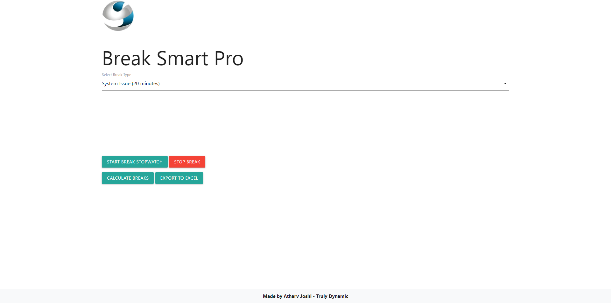

# Break Smart Pro

   

Welcome to Break Smart Pro, a web application to manage breaks for BPO agents. This project is designed to help agents track and optimize their break times effectively.

## Features

- Choose from various break types with different durations.
- Start and stop a break with a built-in stopwatch.
- Visualize break data with dynamic pie and bar charts.
- Export break data to Excel for further analysis.

## Getting Started

### Prerequisites

- Web browser (Google Chrome, Firefox, Safari, etc.)
- Internet connection

### Usage

1. Open the [Break Smart Pro Dashboard] [[https://github.com/atharv3899/BreakSmart-Pro](https://atharv3899.github.io/BreakSmart-Pro/)].
2. Log in using your credentials.
3. Select a break type from the dropdown.
4. Start the break stopwatch.
5. Stop the break when finished.
6. Visualize and export break data as needed.

## Screenshots

## Contributing

Contributions are welcome! Please follow the [contribution guidelines](CONTRIBUTING.md) for more details.

## License

This project is licensed under the GNU License - see the [LICENSE](LICENSE) file for details.

## Acknowledgments

- Logo designed by Atharv Joshi.

---

Made with ❤️ by [Atharv Joshi]
